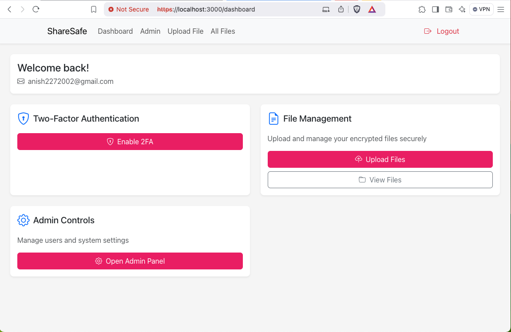

# SecureShare Application

SecureShare is a secure, end-to-end encrypted file storage solution built with React and Django. This application provides robust security features including file encryption, two-factor authentication, and secure file sharing capabilities.

## Table of Contents
- [Features](#features)
- [Technology Stack](#technology-stack)
- [Getting Started](#getting-started)
- [Installation](#installation)
- [Usage](#usage)
- [API Endpoints](#api-endpoints)
- [Contributing](#contributing)
- [License](#license)

## Features
### Security
- End-to-end encryption using AES-256
- Two-factor authentication (2FA)
- JWT-based authentication
- Secure file sharing with granular permissions
- Client-side encryption/decryption
- HTTPS enforcement

### File Management
- Secure file upload with encryption
- File download with automatic decryption
- File organization and listing
- File metadata management
- Progress tracking for uploads/downloads

### User Features
- User registration and authentication
- Two-factor authentication setup
- Profile management
- Session management
- Password reset functionality

## Technology Stack
### Frontend
- React 18
- Redux Toolkit for state management
- React Router for navigation
- Bootstrap 5 for UI
- Axios for API communication
- Web Crypto API for encryption

### Backend
- Django REST Framework
- JWT authentication
- Django storage for file handling

## Getting Started
### Prerequisites
- Node.js (v14 or higher)
- npm or yarn
- Python 3.8+
- Django 5.1.4
- SQLite (for local development)

### Installation
1. **Clone the repository:**
   ```bash
   git clone https://github.com/anish2272002/secure-file-share.git
   cd secure-file-share
   ```

2. **Using Docker Compose:**
    ```bash
    docker compose up --build
    ```

*OR*

2. **Set up the backend:**
   - Navigate to the backend directory:
     ```bash
     cd backend/project
     ```
   - Install the required Python packages:
     ```bash
     pip install -r requirements.txt
     ```

3. **Set up the frontend:**
   - Navigate to the frontend directory:
     ```bash
     cd frontend/secure-app
     ```
   - Install the required Node packages:
     ```bash
     npm install
     ```

4. **Configure environment variables:**
   - Default values are already set in docker-compose.yml file.
     ```env
     REACT_APP_APP_HOST=localhost
     REACT_APP_APP_PORT=8000
     ```

5. **Run the application:**
   - Start the backend server:
     ```bash
     cd backend/project
     python manage.py runserver
     ```
   - Start the frontend application:
     ```bash
     cd frontend/secure-app
     npm start
     ```

## Usage
- Access the application at `http://localhost:3000`.
- Register a new account or log in with existing credentials.
- Upload files securely, manage them, and share them with other users.

## API Endpoints
- **User Registration:** `POST /user/register`
- **User Login:** `POST /user/login`
- **File Upload:** `POST /storage/upload`
- **File List:** `GET /storage/files`
- **Share File:** `POST /storage/share`
- **Generate Shareable Link:** `POST /storage/share/link`

## Contributing
Contributions are welcome! Please follow these steps:
1. Fork the repository.
2. Create a new branch (`git checkout -b feature/YourFeature`).
3. Make your changes and commit them (`git commit -m 'Add some feature'`).
4. Push to the branch (`git push origin feature/YourFeature`).
5. Open a pull request.

